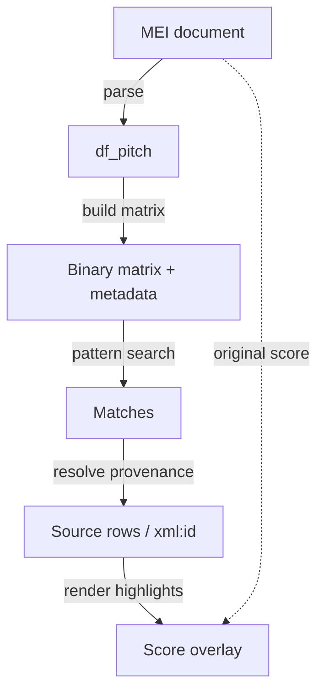

# Analyse music: statistics and pattern search

This is **CAMAT workflow 3**. Choose statistics to summarize musical features,
or pattern search to find and inspect particular passages. Both start from
CAMAT's music representations and can be used independently.

## Before you start

Use common-notation MEI and retain the original score alongside your results.
If you already have `df_pitch` and the associated event and measure context,
you can start analysing them. Otherwise, the tutorial notebooks parse their
own MEI examples; you do not need to complete another notebook first.
[Parse music into CAMAT representations](parsing-representations.md) explains
the tables. Convert other source formats with the
[conversion step in workflow 1](formats.md) when needed.

## Statistics

Explore pitch, pitch-class, and duration distributions, melodic intervals,
successive-pitch transitions, and onset positions within measures. Compare a
whole score with a selected voice or passage using its note and event tables.

Start with [Statistics](statistics.md) and
[`df_statistics.ipynb`](../../notebooks/df_statistics.ipynb).

## Pattern search

Find occurrences of a motif, chord progression, or texture. Define a query,
search a pitch/time representation, compare matches, and follow the selected
notes back to their original notation.

Start with [Pattern search](pattern-search.md). The
[`chord_progression_search.ipynb`](../../notebooks/chord_progression_search.ipynb)
tutorial follows a complete question through to interpreting the results;
the guide also links to convolution and search-method tutorials.

## Understand the representation when you need it

[Binary representations](binary-representations.md) covers piano rolls versus
matrices, time resolution, pickups, reconstruction, voice separation, and
source-note provenance. Consult it alongside a search or when you need to
explain how a representation affects the result.

## Return results to the score

The overlay helpers combine match coordinates, binary-matrix provenance, note
rows, and MEI `xml:id` values. Verovio rendering can then highlight or crop the
corresponding notation. This closes the analytical loop without treating the
matrix as the edition itself.

The analysis returns to the original score through source identities:

## Notebook coverage

The [analysis learning track](../notebooks.md#workflow-3-analyse-music-statistics-and-pattern-search)
groups statistics, applied search, and optional method tutorials. Choose the
branch that matches your question; there is no required sequence across them.
