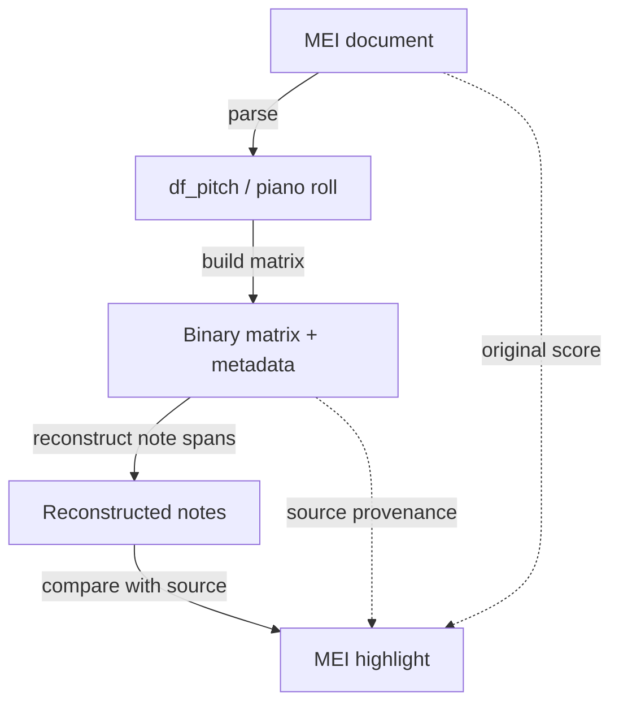

# Binary representations

This companion to [workflow 3](analysis.md) explains the pitch/time grid used
by [pattern search](pattern-search.md), the information it preserves, and
how results remain connected to source notes. Use it when choosing a matrix
resolution, checking a round trip, or tracing a match back to notation.

Start with `df_pitch`, measure offsets, and the original MEI from
[Parse music into CAMAT representations](parsing-representations.md).
The companion notebook parses its own examples and can also be run independently.

## Piano roll versus binary matrix

A piano roll is a visualization of note rows. A binary matrix is a computed
array whose rows are pitch positions and whose columns are time-grid steps.

| | Piano roll | Binary matrix |
| --- | --- | --- |
| Primary purpose | inspect and select notes | compute over a discrete pitch/time grid |
| Time | continuous plot coordinates | quantized by `resolution` |
| Pitch | note positions | full MIDI, cropped range, or chroma rows |
| Provenance | hover/selection can expose rows | must be requested and stored in matrix metadata |

## Create a binary matrix with context

Tutorial notebook:
[`binary_roundtrip.ipynb`](../../notebooks/binary_roundtrip.ipynb)
starts with a deterministic nine-note example, compares time resolutions and
pitch axes, then follows the representation rotation on a real score:



Reconstructed notes describe the matrix's occupied spans. Highlighting uses
the original MEI and source-note provenance; reconstruction alone does not
recover the original note identities.

```python
from camat.music_utils import create_binary_matrix_bundle

bundle = create_binary_matrix_bundle(
    df_pitch,
    source_name="score",
    measure_offsets=measure_offsets,  # pass explicitly for a filtered/renamed table
    resolution_method="auto",
    y_mode="minmax",
    include_provenance=True,
)

matrix = bundle.matrix
matrix_meta = bundle.meta
bundle.plot()
```

The metadata is not optional bookkeeping. It records the time resolution,
pitch-axis orientation and bounds, and—when enabled—the source rows behind
active cells. Store it with the matrix.

## Time grid and pickups

Time starts at zero, with onsets floored and note ends ceiled to the grid. The
matrix extends to the latest sounding note end. Notes crossing zero are clipped;
zero-duration events do not occupy cells. Automatic resolution uses the smallest
positive duration, which need not align every onset. Choose a manual grid when
you need control over that quantization.

To retain negative-onset pickups, use
`grid_notes, grid_offsets, source_origin = prepare_binary_timeline(df_pitch, measure_offsets)`
from `camat.binary_roundtrip`. It shifts notes and barlines together and keeps
the original onset in `Source Global Onset`; source time equals grid time plus
`source_origin`. For Bach's one-quarter pickup, grid time zero is source time
−1, and the first full barline is at grid time 1. Keep the original source table
and MEI for notation identity. Binary plots place MIDI 0 at the bottom and 127
at the top, independently of raw row storage order.

## What a round trip preserves

Roundtrip correctness has distinct meanings:

- **Cell coverage:** reconstruct contiguous runs and re-encode them on the same
  axes. Occupancy should agree exactly.
- **Note events:** touching repetitions and overlapping unisons merge, even on
  an exact grid. Splitting by voice prevents cross-voice merging but does not
  restore repeated-note boundaries within a voice.
- **Source identity:** provenance retains original rows and xml:ids. Binary
  values alone do not retain voices, spelling, articulation or notation choices.

Use `audit_binary_roundtrip(bundle)`, `compare_voice_roundtrips(bundle)` and
`describe_binary_span_sources(bundle)` from
[`camat.binary_roundtrip`](../api/binary_roundtrip.md) to inspect these differences.
Chroma folds octaves: use `binary_slice_to_df` for pitch-class spans and provenance
for original MIDI identities. `binary_matrix_to_df_from_meta` rejects chroma
because there is no unique octave reconstruction.

The notebook follows a search-selected matrix window back to highlighted notes
on complete original MEI pages, retaining all surrounding notes, rests, staves,
clefs and signatures. Its optional extension edits a **copy** of the toy matrix
and generates new notation via
music21, MusicXML and Verovio. Remove original provenance from edited metadata;
new notes must not inherit source xml:ids. Decode the edited array explicitly,
since a bundle's cached reconstructed DataFrame is not refreshed by array edits.

The initial nine-note example is also saved in
[`binary_roundtrip_voices.mei`](../../camat/examples/binary_roundtrip_voices.mei)
with three separate voices and the same note IDs as the table. The notebook
renders this source before demonstrating what occupancy loses.

## Search by voice and follow a match back to notation

`split_binary_voices(bundle)` creates separate voice bundles on identical
pitch/time axes, each with its own provenance. Pass each matrix to
`run_pattern_search` to use the existing metrics and augmentation policies
independently per voice. This prevents a melodic match from being assembled
across voices; it does not restore touching repeated-note boundaries within a
voice. Retaining those requires an event representation or additional onset
and offset channels, beyond a sustain-only binary matrix.

The roundtrip notebook works through two examples with
`find_binary_matches`, `plot_binary_search_trace` and `binary_match_sources`:
a merged-voice perfect fit that scores only 0.5 in every individual voice,
and recovery of a real score fragment. Each follows the same placement from a
heatmap to a binary window and then highlighted source notation. The trace
distinguishes all notes in the rectangle from notes contributing to occupied
query cells. Normalized overlap measures containment; extra host notes are
not penalized, and different placements can tie at 1.0.

Use `vrv_render_source_context(selection, mei_xml=source_mei)` to highlight the
contributing IDs while preserving the complete score on each selected page.
The contributor table can contain only two notes even though the rendered
context contains many more. `vrv_render_symbolic_selection` instead isolates
the selected notes using invisible spaces; that separate view is not the
complete score context used in this walkthrough.

In the notebook, section 7 copies a source fragment as a kernel and selects a
ranked search result. Section 8 interprets the result in its original notation.
Sections 9–10 optionally edit the toy pattern and search with that changed
query, showing the effect of missing query cells on normalized overlap.

## Continue

Use [Pattern search](pattern-search.md) to define a query and compare matches,
then [return results to the score](analysis.md#return-results-to-the-score).
For the APIs, see [music utilities](../api/music_utils.md) and
[binary roundtrip](../api/binary_roundtrip.md).
