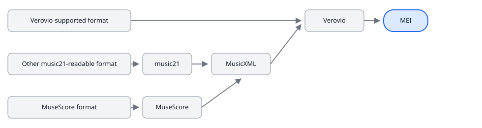

# File formats

CAMAT analyzes **MEI**. `parse_files(...)` expects common-notation MEI and
defaults to the Verovio parser. Convert other encodings to MEI first, then
parse the converted file.

Companion notebook: [`notebooks/camat_formats.ipynb`](https://github.com/egorpol/camat_v2/blob/main/notebooks/camat_formats.ipynb).
Open that file in Jupyter or Cursor from the checkout. It is not executed as
part of this docs build.

## Conversion routes

Verovio always writes the MEI that CAMAT parses. The steps before that depend
on the source format:



| Source                 | Typical extensions                                                       | Route                                        |
| ---------------------- | ------------------------------------------------------------------------ | -------------------------------------------- |
| Already MEI            | `.mei`                                                                 | Parse directly. No conversion.               |
| Verovio-native         | `.musicxml`, `.xml` (MusicXML), `.mxl`, `.krn`, `.abc`, …     | `vrv_convert_to_mei(...)`                  |
| Other music21-readable | `.mid`, `.midi`, and anything music21 can import that Verovio cannot | music21 exports MusicXML, then Verovio       |
| MuseScore              | `.mscz`, `.mscx`                                                     | MuseScore CLI exports MusicXML, then Verovio |

`.xml` is ambiguous (MEI or MusicXML). CAMAT sniffs the file contents rather
than trusting the suffix.

## Already MEI

```python
from camat import parse_files

results, dfs_by_name, df_pitch = parse_files(["path/to/score.mei"])
```

Keep the original file. Conversion is an import step, not an archival
replacement.

## Verovio-native formats

Use the public helper. It loads the source into Verovio, returns MEI as a
string, and leaves that score in the toolkit for rendering:

```python
from pathlib import Path
from camat import vrv_convert_to_mei, vrv_guess_input_from, vrv_quiet

source = "path/to/score.musicxml"
print(vrv_guess_input_from(source))

with vrv_quiet():
    mei_text = vrv_convert_to_mei(source)

Path("score.mei").write_text(mei_text, encoding="utf-8")
```

Native Verovio inputs include MEI, MusicXML / compressed MusicXML, Humdrum,
ABC, PAE, DARMS, EsAC, and Volpiano.

## Remote sources

For a direct internet source, use a raw file URL and pass `is_url=True`. A
GitHub repository or `blob` page is HTML and is not a score source.

```python
from pathlib import Path
from camat import vrv_convert_to_mei, vrv_quiet

url = (
    "https://raw.githubusercontent.com/craigsapp/bach-370-chorales/"
    "0fd9e00542445a522c6030c80c687b874aa569d5/kern/chor001.krn"
)

with vrv_quiet():
    mei_text = vrv_convert_to_mei(url, is_url=True, timeout=30)

Path("bach_chor001.mei").write_text(mei_text, encoding="utf-8")
```

The example uses Craig Stuart Sapp's
[Bach 370 Chorales](https://github.com/craigsapp/bach-370-chorales)
edition, licensed
[CC BY-NC-SA 4.0](https://github.com/craigsapp/bach-370-chorales/blob/main/LICENSE.txt).
The commit-pinned raw URL keeps the tutorial reproducible. The notebook catches
network failures so its local examples can still run offline.

## music21 bridge

Formats Verovio cannot identify, including MIDI, go through music21. Export
MusicXML, then convert that MusicXML with Verovio so the analysis file is
still Verovio MEI:

```python
from pathlib import Path
from music21 import converter
from camat import vrv_convert_to_mei, vrv_quiet

score = converter.parse("path/to/score.mid")
musicxml_path = Path(score.write("musicxml"))

with vrv_quiet():
    mei_text = vrv_convert_to_mei(str(musicxml_path))
```

MIDI in particular is lossy: spelling, voices, meter, and articulations are
reconstructed. Inspect the MEI before treating it as ground truth.

## MuseScore files

`.mscz` / `.mscx` are not Verovio inputs. If MuseScore Studio or the `mscore`
CLI is on `PATH` (or `MUSESCORE_BIN` points at it), export MusicXML with
MuseScore, then convert with Verovio. Without MuseScore, convert the file to
MusicXML or MEI in the editor first.

The repository helper `scripts/test_verovio_conversion.py` implements that
route for corpus probes. The tutorial notebook shows the same shape with the
public `vrv_convert_to_mei(...)` API.

## After conversion

Point `parse_files(...)` at the generated `.mei`, not at the original MusicXML
or MIDI:

```python
from camat import parse_files

results, dfs_by_name, df_pitch = parse_files(["score.mei"])
```

This also applies to downloaded scores: parse the saved MEI rather than passing
a remote Humdrum or MusicXML URL directly to the default MEI parser.

Generated `xml:id` values are stable for a fixed Verovio version and options.
They are not permanent scholarly identifiers across Verovio upgrades. Keep the
source file next to the MEI.

## See also

- Tutorial notebook: [`notebooks/camat_formats.ipynb`](https://github.com/egorpol/camat_v2/blob/main/notebooks/camat_formats.ipynb)
- Batch conversion: [Batch conversion](batch-conversion.md) and
  [`notebooks/camat_batch_conversion.ipynb`](https://github.com/egorpol/camat_v2/blob/main/notebooks/camat_batch_conversion.ipynb)
- API: [`vrv_convert_to_mei`](../api/verovio_render.md)
