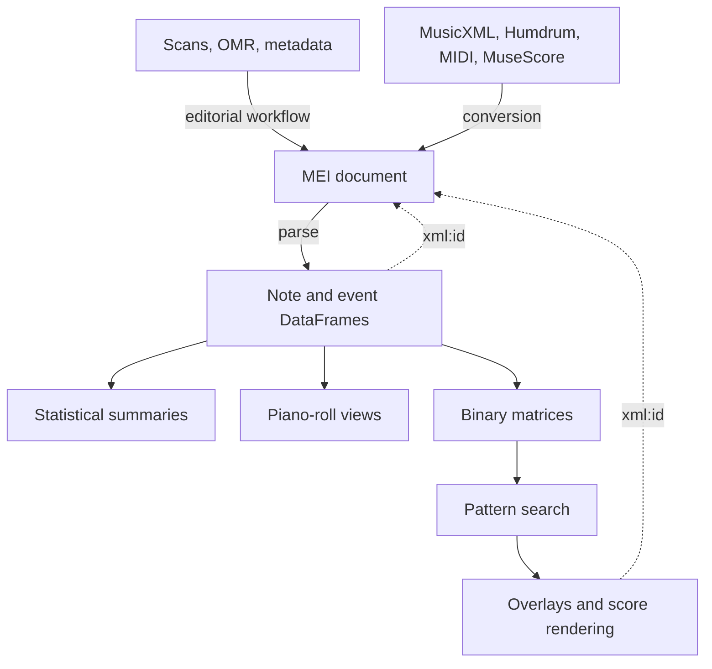

# CAMAT

## What CAMAT is

CAMAT (Computer-Assisted Music Analysis Toolbox) is an **MEI-centred Python
toolbox for editorial and analytical work with symbolic music**. It uses MEI
(Music Encoding Initiative) as the durable musical document connecting score
editing, conversion, parsing, statistics, and pattern search.

An existing MEI edition can go straight to parsing, while a MusicXML or Humdrum
source first passes through conversion. Preserve the MEI alongside derived
tables and matrices so that analysis results can be traced back to the score.

Start with [Getting started](getting-started.md) to choose a workflow, install
CAMAT, and run an offline example. Use [Cloud notebooks](cloud-notebooks.md) on
Jupyter4NFDI or Colab. The [notebook roadmap](notebooks.md) groups the
executable tutorials into independent learning tracks.

## From musical document to analysis

MEI is the centre of this diagram deliberately. DataFrames and matrices are
derived working representations; they do not replace the edition.

## Working with MEI

Editing and preparing music covers the MEI document itself: learning its XML
structure, rendering it, checking it, and improving it. Edition building adds
corpus metadata, facsimile links, measure zones, validation, and corrections.
Those helpers were developed while encoding the
[edition corpora](guides/edition-corpora.md).

Conversion is part of this preparation. It imports other symbolic encodings
into MEI: Verovio writes the final MEI, with Music21 or MuseScore acting as an
earlier bridge where needed. The generated score must still be inspected,
especially after MIDI or OMR-derived input. The hand-off to parsing is a valid
MEI file with stable `xml:id` values where possible. See
[Editing music with the MEI data format](guides/edition-building.md).

## CAMAT music representations

The default Verovio parser reads common-notation MEI and separates two kinds of
information:

- `df_pitch`: note rows with pitch, onset, duration, voice, and MEI identity;
- `df_events`: rests, barlines, directions, dynamics, text, spans, and other
  non-note events.

The result record also carries context such as measure offsets and the parser
backend. See [Parse music into CAMAT representations](guides/parsing-representations.md).

DataFrame analyses retain musically meaningful columns and identities. Matrix
analyses discretize pitch and time for operations such as pattern search. A
binary matrix is derived from `df_pitch`; its resolution and provenance
metadata are part of its meaning. See
[Analyse music: statistics and pattern search](guides/analysis.md).

## Boundaries that prevent confusion

- **MEI is the source document.** Preserve it alongside every derived result.
- **Conversion does not certify an edition.** It changes encoding and may be
  lossy.
- **Parsing does not normally edit MEI.** It creates Python representations for
  inspection and analysis.
- **A piano roll is a view; a binary matrix is analysis data.** They may look
  similar, but the matrix has an explicit time grid and may fold or crop pitch.
- **`xml:id` is the bridge back to the score.** Retain identifiers and matrix
  provenance when an analysis result must be highlighted in notation.
- **Specialized sources have specialized contracts.** The timeline backend for
  rap Humdrum creates `df_timeline`; it is not a common-notation `df_pitch`
  parser. Mensural and timeline paths are experimental; see
  [Known limitations](known-limitations.md).

## Go further

- [Known limitations](known-limitations.md) describes supported notation and experimental paths.
- [API reference](reference.md) maps the Python modules and entry points.
- [Edition corpora](guides/edition-corpora.md) introduces CAMAT's working editions and other MEI collections.
- [About CAMAT](about.md) covers the project team, funding, citation, and licenses.

These docs describe their source checkout. See
[package and documentation versions](releasing.md#documentation-and-package-versions)
when using an older release or a development branch.
