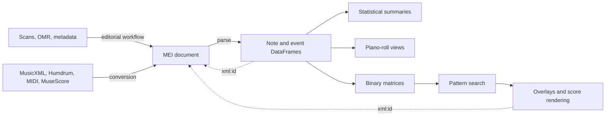

# What CAMAT is

CAMAT is an **MEI-centered toolbox for editorial and analytical work with
symbolic music**. It is not a single converter or parser. It connects several
workflows by using MEI as the durable musical document between them.

The workflows can be used independently. An existing MEI edition can go
straight to parsing, while a MusicXML or Humdrum source first passes through
conversion.

## Four workflows

| Workflow | Starts with | Produces | Current location |
| --- | --- | --- | --- |
| 1. Create an MEI edition | scans, OMR output, metadata, or draft MEI | reviewed and enriched MEI | production in [`camat_corpus`](https://github.com/egorpol/camat_corpus); reusable facsimile inspection in this package |
| 2. Convert to MEI | MusicXML, Humdrum, MIDI, MuseScore, and other symbolic formats | MEI suitable for inspection and parsing | `camat.conversion` in this package |
| 3. Parse and represent MEI | common-notation MEI | Python result records, note and event DataFrames, and visual previews | this package |
| 4. Analyse representations | DataFrames or derived matrices | distributions, piano rolls, binary matrices, pattern matches, and score overlays | this package |

MEI is the center of this diagram deliberately. DataFrames and matrices are
derived working representations; they do not replace the edition.

## What each layer is responsible for

### Editorial layer

The editorial layer creates and improves the source document: corpus metadata,
facsimile links, measure zones, validation, and corrections. This work
mostly lives in the separate `camat_corpus` repository. The read-only
MEI/facsimile viewer is available in this package for local inspection; the
hand-off to later CAMAT workflows remains a valid MEI file with stable
`xml:id` values where possible.

### Conversion layer

Conversion imports a score from another encoding. Verovio writes the final MEI;
Music21 or MuseScore may act as an earlier bridge for formats Verovio cannot
read directly. Conversion is not editorial validation: the generated MEI must
still be inspected, especially after MIDI or OMR-derived input.

### Representation layer

The default Verovio parser reads common-notation MEI and separates two kinds of
information:

- `df_pitch`: note rows with pitch, onset, duration, voice, and MEI identity;
- `df_events`: rests, barlines, directions, dynamics, text, spans, and other
  non-note events.

The result record also carries context such as measure offsets and the parser
backend. See [Parse and represent MEI](guides/parsing-representations.md).

### Analysis layer

DataFrame analyses retain musically meaningful columns and identities. Matrix
analyses discretize pitch and time for operations such as pattern search. A
binary matrix is therefore a second-order representation derived from
`df_pitch`; its resolution and provenance metadata are part of its meaning.

See [Analyse representations](guides/analysis.md).

## Boundaries that prevent confusion

- **MEI is the source document.** Preserve it alongside every derived result.
- **Conversion does not certify an edition.** It changes encoding and may be
  lossy.
- **Parsing does not normally edit MEI.** It creates Python representations for
  inspection and analysis.
- **A piano roll is a view; a binary matrix is analysis data.** They may look
  similar, but the matrix has an explicit time grid and may fold or crop pitch.
- **`xml:id` is the bridge back to the score.** Retain identifiers and matrix
  provenance when an analysis result must be highlighted in notation.
- **Specialized sources have specialized contracts.** The timeline backend for
  rap Humdrum creates `df_timeline`; it is not a common-notation `df_pitch`
  parser.

## Choose a starting point

| If you want to… | Start here |
| --- | --- |
| prepare facsimiles or construct an MEI edition | [Create MEI editions](guides/edition-building.md) |
| inspect measure-to-facsimile links in a local MEI | [MEI facsimile viewer](api/facsimile_viewer.md) |
| import another score format | [File formats](guides/formats.md) |
| convert a corpus and keep a report | [Batch conversion](guides/batch-conversion.md) |
| inspect MEI as Python objects and tables | [Parse and represent MEI](guides/parsing-representations.md) |
| calculate distributions or search musical patterns | [Analyse representations](guides/analysis.md) |
| learn interactively | [Notebook roadmap](notebooks.md) |
